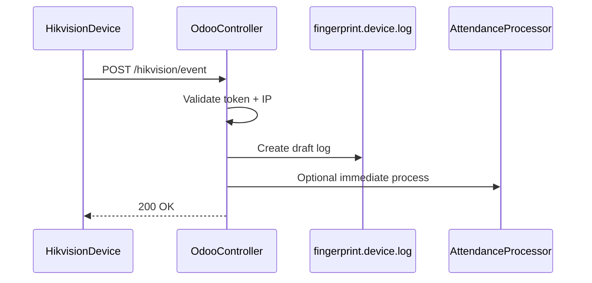

# Hikvision HTTP Listening — Design (Not Implemented)

## Overview

Optional real-time event ingestion via Hikvision HTTP Listening, complementing the existing pull-based cron sync.

## Endpoint

```
POST /hikvision/event
Content-Type: application/json
Authorization: Bearer <device_token>
```

## Security

- **Bearer token** per device stored on `fingerprint.device` (technical group only)
- **IP allowlist** — only accept from device IP / VPN range
- **No public exposure** — reverse proxy (nginx) on internal network only
- Rate limit: 60 req/min per device
- Validate payload schema before any ORM write

## Flow



1. Authenticate request
2. Normalize payload (reuse `HikvisionClient._normalize_access_event` logic)
3. Apply same `classify_sync_event` rules as pull sync
4. Store `fingerprint.device.log` as draft
5. Optionally call `AttendanceProcessor.process_logs` for that log
6. Return 200 with `external_id`

## Fallback

- **Cron sync remains enabled** — HTTP listening is additive; missed events recovered on next pull
- Checkpoint / lookback unchanged

## Configuration (future)

| Field | Model |
|---|---|
| `http_listening_enabled` | fingerprint.device |
| `http_listening_token` | fingerprint.device |
| `http_listening_allowed_ips` | fingerprint.device |

## Out of scope

- TLS termination on device
- Exposing Odoo to the public internet
- Replacing ISAPI pull sync
